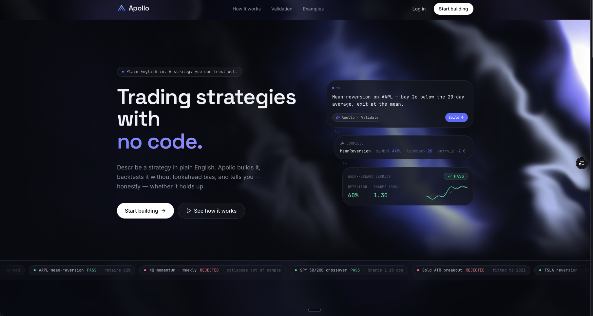
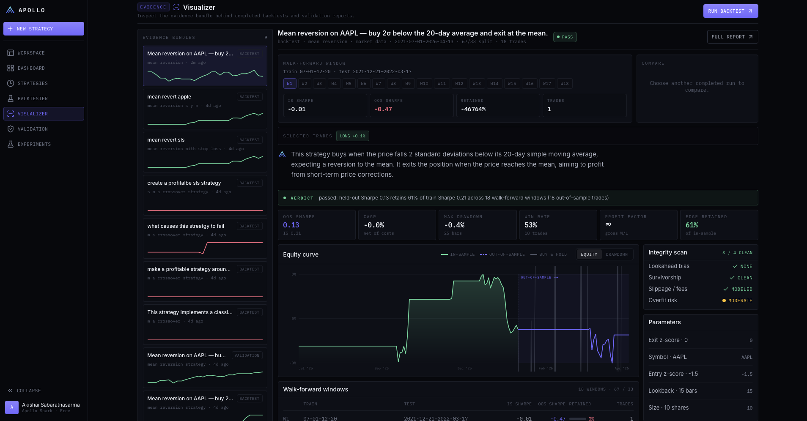

# Apollo

**Describe a trading strategy in plain English. Apollo builds it, then refuses to trust it until it survives a walk-forward overfit gate inside a sandbox where the future physically does not exist.**

[](https://apollo-bay.vercel.app)
[](https://github.com/Akishai18/Apollo/actions/workflows/ci.yml)


Apollo is a platform for developing and **validating** algorithmic trading strategies. You describe a strategy (or paste Python), an LLM turns it into a real parameterized `Strategy` class, and the platform treats that code as hostile: it runs it in a locked-down process, backtests it against a simulator that only ever hands the strategy data up to the current bar, then re-fits and re-tests it across rolling train/held-out windows and rejects anything whose edge collapses out of sample. Every verdict comes with a one-line reason a non-quant can read and the evidence behind it.

The natural-language input is the demo. **The validation layer is the product.**

**Live:** [apollo-bay.vercel.app](https://apollo-bay.vercel.app)



---

## What it does

| Page | What you get |
|------|--------------|
| **Workspace** (`/app`) | Prompt-first builder. Describe a strategy or paste code; Apollo generates a parameterized strategy, statically validates it, runs the build → backtest → validation thread with live progress over WebSocket, and renders the verdict inline. Prompt numbers become sweepable parameters instead of hardcoded constants. |
| **Backtester** | The lab. Edit strategy source, pick a template or draft, choose the data environment (synthetic series, Yahoo Finance, or a Databricks Delta table), set symbol, date range, seed, starting cash, train/test window sizes, and the parameter grid, then run it and inspect metrics, trades, and the per-window grid results. |
| **Visualizer** | The evidence bundle behind any completed run: in-sample vs. held-out equity with the split marked, per-window train vs. test bars, the parameter-sweep heatmap (a robust edge is a broad green region; an overfit one is a lone hot cell), monthly returns, and the trade log. |
| **Validation** | The gate. Formal walk-forward evidence for strategies promoted from the lab, with the pass/reject reason and every window's numbers. |
| **Strategies** | Each strategy's drafts, frozen versions, and runs. Promote a version to champion or demote it; champions can be re-validated on fresh data on a schedule to catch edge decay. |
| **Report** (`/app/runs/[id]`) | The verdict as an inspectable audit: header, metric tiles, Equity / Windows / Sweep tabs, the reasoning, and next actions. |
| **Dashboard** | Every strategy you have put through the gate and how it held up. |
| **Experiments** | Every validation logged to MLflow, comparable and reproducible. |

<p align="center">
  
</p>

**Data.** Three market-data providers behind one adapter: a committed, deterministic synthetic OHLCV fixture for reproducible tests; Yahoo Finance with a local parquet cache; and a Databricks Delta table read through a SQL Warehouse with time travel (`VERSION AS OF` / `TIMESTAMP AS OF`) so a run can be pinned to an exact data version. Ingestion is a Databricks job with a Delta Live Tables bronze → silver → gold pipeline and data-quality expectations.

**Generation.** Tiered LLM providers (Apollo Spark, Core, and Prime) behind a single provider seam, with Gemini and Claude backends, prompt caching on the fixed strategy-contract system prompt, and an offline mock so the whole product runs without any API key. Generated code is statically validated and repaired before it is ever executed.

**Accounts.** Supabase email/password auth with JWT verification on the API (HS256 or asymmetric keys via the project's JWKS, algorithm pinned server-side) and Postgres row-level security so every run, draft, and version is scoped to its owner twice: in the app layer and in the database.

---

## How it works

```
"Buy when the 20-day z-score drops below -1, sell when it reverts"
        │
        ▼
Generator ──── tiered LLM providers (Gemini / Claude / offline mock)
        │      fixed, prompt-cached contract prompt; static validation + repair
        ▼
Sandbox ──── the strategy's on_tick runs in a separate process locked down
        │    by setrlimit (no files, no sockets, no child processes, CPU and
        │    memory budgets); Docker executor for the production wall
        ▼
Engine ──── for each t: view = adapter.make_view(dataset, t)   ← lookahead boundary
        │              orders = sandbox.run(strategy.on_tick, view)
        │              fills  = adapter.apply_orders(orders, state, t)
        ▼
Environment adapter ──── next-bar-open fills, slippage, fees, position limits;
        │                synthetic / Yahoo / Databricks Delta data
        ▼
Overfit gate ──── walk-forward: sweep the parameter grid on each train window,
        │         evaluate the chosen params on the held-out window, reject
        │         when out-of-sample performance collapses
        ▼
Verdict ──── passed / rejected + legible reason + per-window evidence
        │    (equity curves, sweep heatmap, trades), logged to MLflow
        ▼
FastAPI ──── REST + WebSocket progress, Supabase JWT auth, Postgres + RLS
        ▼
Next.js app ──── Workspace, Backtester, Visualizer, Validation, Report
```

The engine is deliberately dumb: it steps time and asks the adapter for a view. Swap the adapter and everything else is identical, which is what makes "general" honest rather than a slogan.

---

## The trust guarantees

Most backtesters detect lookahead bias by inspection, treat one good equity curve as proof, and run user code in-process. Apollo is built so that each of those shortcuts is structurally unavailable.

### 1. Lookahead is impossible by construction

A strategy is a class with one method. The only thing it is ever handed is a `MarketView`, and that view is a physical slice of the dataset ending at the current bar. There is no method on it that can reach index `t + 1`, because the data past `t` is not in the object.

```python
class Strategy(ABC):
    def __init__(self, params: dict[str, Any]) -> None:
        self.params = params          # from the user or the sweep, never hardcoded

    @abstractmethod
    def on_tick(self, view: MarketView) -> list[Order]:
        """Called once per timestep. `view` exposes data up to and including now."""
```

| `MarketView` | Returns |
|---|---|
| `now` | the current bar index |
| `history(symbol, field, lookback)` | the last `lookback` values ending at `now` |
| `last(symbol, field)` | the value at `now` |
| `symbols()`, `fields(symbol)` | metadata for enumerating the bar |

The guarantee is property-tested with Hypothesis rather than example-tested: on a ramp dataset where every value equals its index, Hypothesis searches over lengths and timesteps and asserts that nothing a view exposes is greater than `t`. The simulator itself may read `open[t+1]` to price a fill at the next bar's open, but the strategy never can. Process separation completes the picture: only bars `<= t` ever cross the boundary into the sandbox.

### 2. A backtest is not a verdict

The overfit gate re-runs the strategy across rolling windows. On each window it sweeps the parameter grid on the train slice, picks the best parameters there, and then evaluates those same parameters on the held-out slice that the selection never saw. Held-out data is physically absent during selection (a `Dataset.window()` slice, the same construction as the lookahead law), and every run gets a fresh strategy instance so no state leaks across the split.

| Rule | Rejects when |
|------|--------------|
| Never profitable | mean in-sample Sharpe is not positive; there was never an edge to lose |
| Insufficient evidence | too few completed out-of-sample round trips to judge |
| Collapse | held-out Sharpe retains less than `min_retention` (default 50%) of in-sample Sharpe |

Verdicts are always a sentence, never just a boolean:

```
rejected: performance collapses out of sample — held-out Sharpe -1.20 retains -69% of
          train Sharpe 1.74 (threshold 50%); the edge looks fitted to the training windows

passed:   held-out Sharpe 0.91 retains 60% of train Sharpe 1.52 across 4 walk-forward
          windows (37 out-of-sample trades)
```

The canonical curve-fit (a strategy that trades on fixed bar indices) is rejected, and each window chose a *different* lucky timing in-sample, which is exactly the tell. A mean-reversion strategy on an Ornstein-Uhlenbeck series passes. Both are deterministic and locked in tests, along with the full per-window evidence the UI renders: chosen params, train and test metrics, the whole sweep, equity curves, and trades.

### 3. Generated code gets no shortcut

Every strategy the gate builds runs through `SandboxedStrategy`; there is no trusted in-process path in the API. The strategy source runs in a separate Python process that locks itself down with `setrlimit` before the first strategy line executes:

| Limit | Effect |
|-------|--------|
| `RLIMIT_CPU`, `RLIMIT_AS` | CPU and address-space budgets per run |
| `RLIMIT_FSIZE` | file-size budget (only the captured stderr can grow) |
| `RLIMIT_NPROC = 0` | no child processes |
| `RLIMIT_NOFILE` ceiling | every free descriptor slot is plugged with `/dev/null`, so any new file or socket open fails with `EMFILE` at the kernel |

The parent talks to the child over a JSON-line protocol (never pickle), enforces wall-clock deadlines per init and per tick, and SIGKILLs the whole process group on timeout. Strategy `print()` is redirected to stderr so it cannot forge protocol frames. `DockerExecutor` speaks the same protocol over `docker run --network=none --read-only --cap-drop=ALL --security-opt=no-new-privileges --memory --pids-limit`, sharing a base class with the subprocess executor so the two cannot drift.

Sandboxed runs are bit-identical to native runs, so the sandbox costs nothing in fidelity: the full walk-forward gate reproduces its verdict field-for-field through the sandbox. Crashes surface with the strategy's own traceback, infinite loops are killed, and file, network, and spawn attempts die at the kernel, all pinned by tests.

---

## Tech stack

| Layer | Technology |
|-------|------------|
| Core and validation | Python 3.12+, pydantic v2 (immutable contracts), polars, Hypothesis property tests |
| Sandbox | `setrlimit`-locked subprocess, Docker executor (path to gVisor / Firecracker) |
| API | FastAPI (REST + WebSocket), Uvicorn, psycopg 3 with a connection pool, PyJWT |
| Generation | Anthropic Claude API and Google Gemini behind one provider seam, prompt caching |
| Data | Yahoo Finance (`yfinance`), Databricks Delta via SQL Warehouse, Delta Live Tables pipeline, parquet caching |
| Tracking | MLflow (params, out-of-sample metrics, and source per validated run) |
| Frontend | Next.js 16 (App Router), React 19, TypeScript, Tailwind CSS 4, framer-motion, hand-rolled SVG data viz, a WebGL shader background |
| Auth and storage | Supabase (Auth, Postgres with row-level security) |
| Hosting | Vercel (web), AWS Lightsail Containers (API, Docker) |
| CI/CD | GitHub Actions: ruff, ruff format, pyright strict, pytest; OIDC deploy to ECR and Lightsail (no stored AWS keys) |
| Tooling | uv workspace (each layer is a package, so layer boundaries are enforced by dependencies, not convention), ruff, pyright strict |
| Tests | pytest, 123 tests across the engine, adapters, gate, sandbox, API, and generator |

---

## Project structure

```
Apollo/
├── core/                   # The trust core. Environment-agnostic; imports nothing else.
│   └── src/green/core/     # engine, MarketView + SlicedView, Strategy contract, Dataset,
│                           # portfolio + recorder, metrics, trades, indicators, overfit/ (the gate)
├── adapters/               # Pluggable environments (depend on core only)
│   └── src/green/adapters/ # toy (Ornstein-Uhlenbeck), market_data (fixture / yahoo / delta),
│                           # synthetic fixture generator
├── strategies/             # Reference strategies: buy-and-hold, mean reversion, MA crossover
├── sandbox/                # Isolation boundary around untrusted on_tick
│   ├── src/green/sandbox/  # runner (child, setrlimit lockdown), executor (subprocess + Docker),
│   │                       # SandboxedStrategy
│   └── Dockerfile          # image for the Docker executor
├── generator/              # Natural language → Strategy subclass
│   └── src/green/generator/# contract prompt, provider seam (Claude / Gemini / mock), validation
├── api/                    # FastAPI backend, the authoritative brain
│   ├── src/green/api/      # app + routes, jobs (JobRunner), auth (JWT / JWKS), store
│   │                       # (memory / SQLite / Postgres), registry, templates, tracking, assistant
│   └── migrations/         # Supabase schema + row-level-security policies
├── web/                    # Next.js frontend
│   ├── app/                # landing page, login/signup, (app)/app/* pages
│   ├── components/         # landing components, app shell, report + data-viz components
│   └── lib/                # API client (REST + WebSocket), report view-model, auth context
├── scripts/                # Databricks ingestion + DLT pipeline, scheduled revalidation, decay alerts
├── deploy/                 # Lightsail deployment guide and one-time AWS setup scripts
├── docs/                   # Product spec, roadmap + implementation history, original brief
├── .github/workflows/      # ci.yml, deploy_api.yml
├── Dockerfile              # API image
├── pyproject.toml          # uv workspace root, ruff + pyright + pytest config
└── uv.lock
```

Each layer also carries a `CLAUDE.md` stating its contract and the invariants edits must respect.

---

## Running locally

**Prerequisites:** Python 3.12+, [uv](https://docs.astral.sh/uv/), Node.js 20+. Docker is optional (only for the Docker executor and its test).

```bash
git clone https://github.com/Akishai18/Apollo.git
cd Apollo
```

**Backend**

```bash
uv sync                                          # installs every workspace member + dev tools
cp .env.example .env                             # optional: LLM keys, store backend, auth
uv run uvicorn green.api:app --reload --port 8000
```

With no `.env` at all the API runs fully offline: auth is off (requests resolve to a fixed dev user), runs are stored in memory, and the generator falls back to its mock provider, so the entire sandbox + gate pipeline runs for real. Interactive docs at http://localhost:8000/docs, health check at http://localhost:8000/healthz.

**Frontend**

```bash
cd web
cp .env.example .env.local                       # NEXT_PUBLIC_API_URL, optional Supabase keys
npm install
npm run dev                                      # http://localhost:3000
```

Leave the Supabase variables unset for local dev mode (no login); set `NEXT_PUBLIC_SUPABASE_URL` and `NEXT_PUBLIC_SUPABASE_ANON_KEY` to enable real sign-in.

**Checks** (the same four steps CI runs)

```bash
uv run ruff check .
uv run ruff format --check .
uv run pyright
uv run pytest
```

**Regenerating the synthetic fixture** (optional, it is committed and deterministic)

```bash
uv run python -m green.adapters.synthetic
```

---

## API overview

| Group | Endpoints |
|-------|-----------|
| Runs | `POST /runs` (submit source + config), `GET /runs`, `GET /runs/{id}`, `WS /runs/{id}/ws` (live progress → verdict), `POST /runs/{id}/validate` |
| Generation | `POST /generate` (prompt → strategy → run), `GET /templates`, `POST /assistant/strategy` |
| Strategy lifecycle | `POST /strategies`, `GET /strategies`, `GET /strategies/{id}`, `POST /strategies/{id}/drafts`, `PATCH /drafts/{id}`, `POST /drafts/{id}/versions`, `POST /versions/{id}/backtest`, `POST /versions/{id}/validate`, `POST /strategies/{id}/promote`, `POST /strategies/{id}/demote` |
| Operations | `POST /maintenance/revalidate`, `GET /maintenance/alerts` (edge decay), `GET /experiments/runs` (MLflow), `GET /healthz` |

Every strategy-, draft-, version-, and run-scoped read is ownership-checked; another user's object is a 404, never a leak. Untrusted source always runs sandboxed; bad config and hostile strategies surface as clean run errors, never a 500 or a hang.

---

## Deployment

- **Web** on Vercel with `web` as the root directory, pointed at the API through `NEXT_PUBLIC_API_URL`.
- **API** as a Docker container on AWS Lightsail. `.github/workflows/deploy_api.yml` builds the image, pushes it to ECR, rolls out a new Lightsail deployment, and polls until the service is running, authenticating with GitHub OIDC (no stored AWS keys).
- **Database and auth** on Supabase: run `api/migrations/0001_init.sql` once to create the tables and row-level-security policies.
- **Scheduled jobs**: `scripts/revalidate.py` and `scripts/decay_alerts.py` re-run promoted strategies on fresh data and flag the ones that no longer hold up; market-data ingestion runs as a Databricks job.

Setup guide: [`deploy/README.md`](deploy/README.md).

---

## Documentation

- [`docs/PRODUCT.md`](docs/PRODUCT.md): product thesis, objects, the four main features, trust principles, and feature contracts
- [`docs/PLAN.md`](docs/PLAN.md): roadmap, architectural decisions, and the phase-by-phase implementation history
- [`docs/project-brief.md`](docs/project-brief.md): the original brief and motivation
- [`deploy/README.md`](deploy/README.md): infrastructure and deployment
- [`CLAUDE.md`](CLAUDE.md) and the per-layer `CLAUDE.md` files: layer contracts and the cardinal rule (dependencies point inward toward `core`)

---

## Disclaimer

Apollo is a research and educational tool. It is not investment advice, not a trading signal service, and makes no guarantee about the future performance of any strategy it validates. A passed verdict means the strategy survived the gate on historical data, nothing more. Consult a qualified financial professional before making investment decisions.

## Author

**Akishai Sabaratnasarma**, Software Engineering, University of Waterloo.
Questions or ideas: [open an issue](https://github.com/Akishai18/Apollo/issues).
